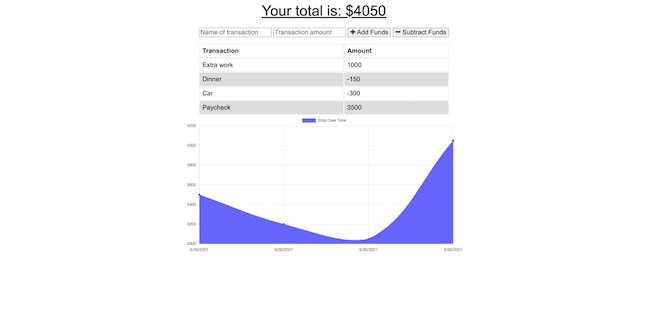

# 19-PWA-Online-Offline-Budget-Trackers

# Description 

Added functionality to the existing Budget Tracker application to allow for offline access and functionality.

The user will be able to add expenses and deposits to their budget with or without a connection. When entering transactions offline, they should populate the total when brought back online.

Offline Functionality:

- Enter deposits offline

- Enter expenses offline

When brought back online:

- Offline entries should be added to tracker.

# Table of Contents

1. [Description](#Description)
2. [Features](#Features)
3. [License](#License)
4. [Contributing](#Contributing)
5. [Questions](#Questions)
6. [Usage](#Usage)
7. [Badges](#Badges)

## Features
- NodeJS
- MongoDB
- Nosql

# License

## This application is covered by the MIT license. 

# Contributing
Contributions are excepted. Fill free to fork. 

# Questions
## GitHub User name 
https://github.com/jmnfire

# Usage 

### Link to GitHub:
https://github.com/jmnfire/19-PWA-Online-Offline-Budget-Trackers

### To access the website via Heroku
https://enigmatic-beyond-85347.herokuapp.com/

### Email address 
jovan.m.nixon@gmail.com

# Badges

